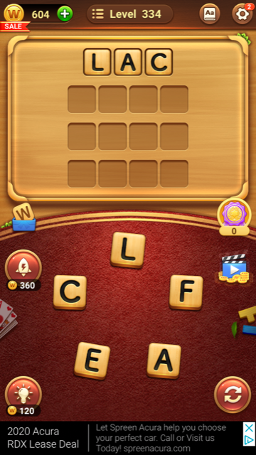

  
# word-game-breaker
This Python app was designed to cheat at the Word Game app pictured above.

### [Try it out](https://Jacob-Webb.com/cgi-bin/word_game_breaker.py)

### Motivation
The Word Connect mobile app challenges the user with deriving multiple words from a given set of letters. While sitting in my Operating Systems class I got tired or trying to figure out all of the permutations, so I wrote this little ... assistant. 
 
I also wanted to try Python. 

### Tech Stack
* Python 